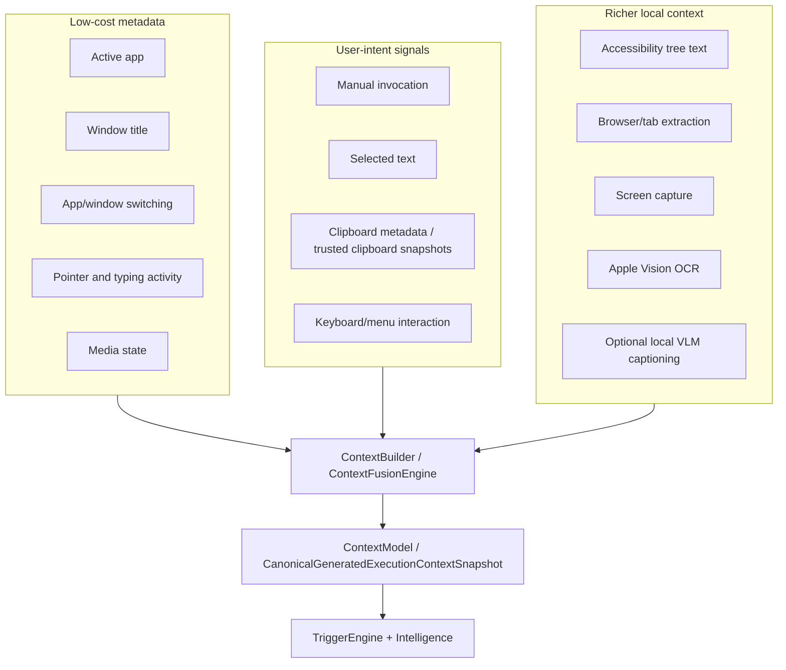
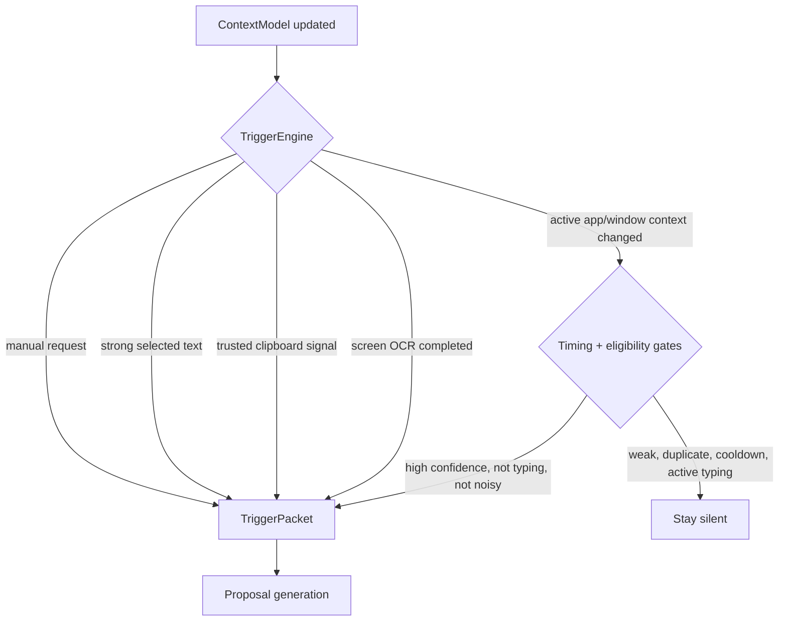
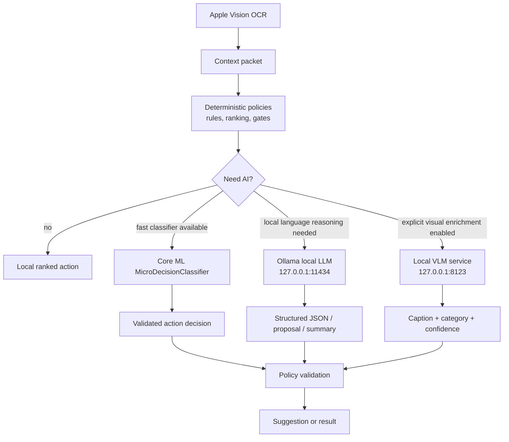
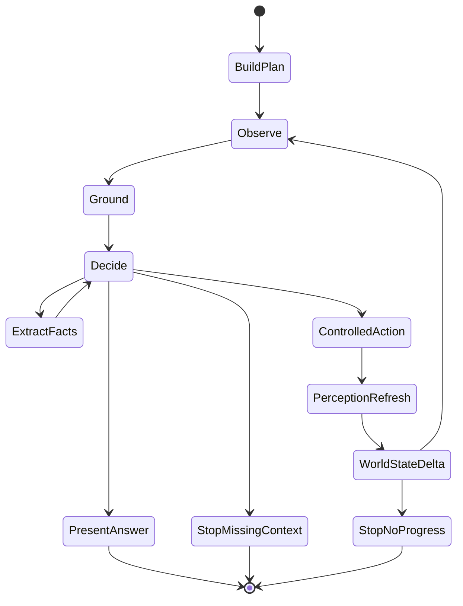
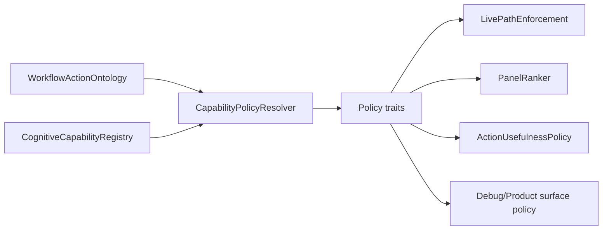
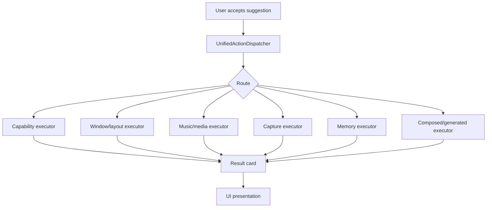
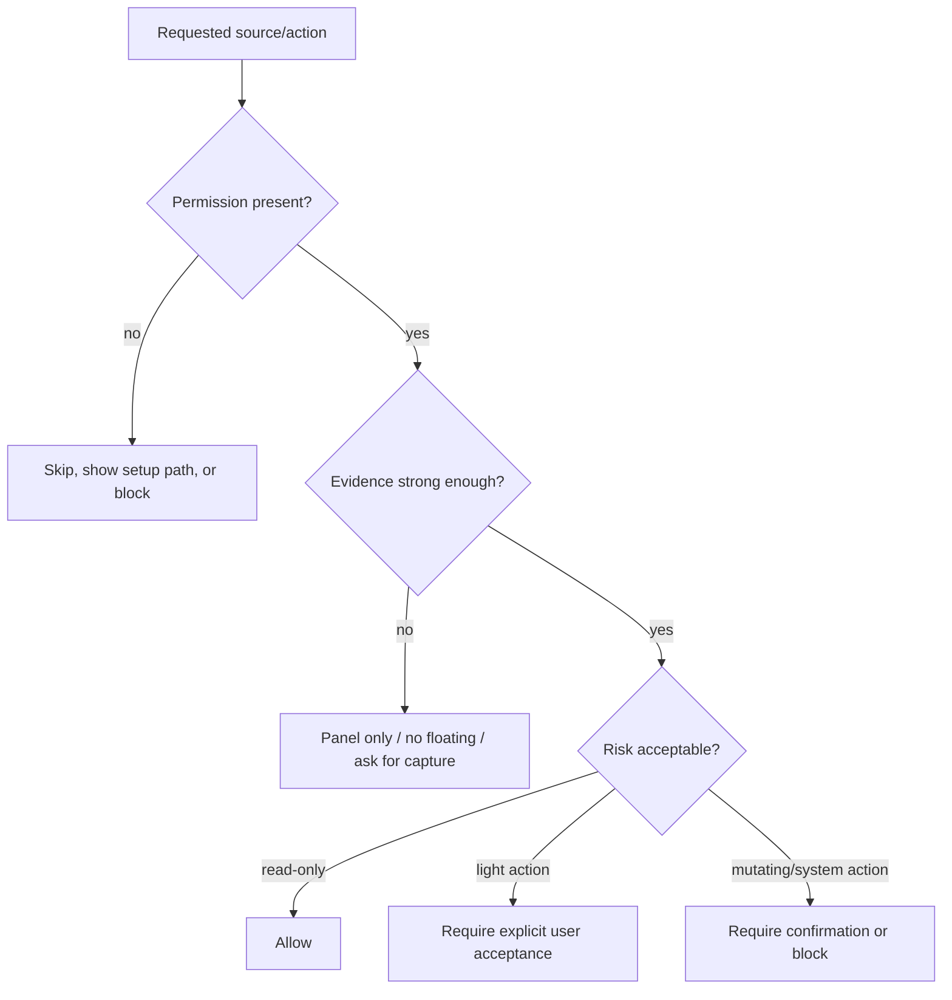

# Contextual

Contextual is a macOS-native, privacy-first, context-aware assistant. It runs as a lightweight background layer, gathers permitted local context, decides when a situation is worth surfacing, and presents useful actions without requiring the user to write prompts.

The project is intentionally not a chatbot-first app. The core product idea is an ambient action layer: the Mac understands enough about the current workflow to offer the right local action at the right time, while staying quiet when confidence is low.

## Current Status

This repository contains a substantial prototype of the Contextual app:

- A macOS menu bar app and floating UI surfaces.
- Layered local context collection from app/window metadata, clipboard metadata, selected text, Accessibility text, pointer/typing activity, optional screenshots, OCR, browser/window signals, and working-memory snapshots.
- Deterministic trigger, ranking, grounding, usefulness, cooldown, and safety policies.
- A cognitive capability registry and workflow action ontology.
- A unified suggestion and execution path.
- Local AI integration scaffolding through Ollama, Core ML, Apple Vision OCR, and optional local VLM HTTP service.
- Agentic observe-decide-act runtime experiments with bounded actions, evidence gates, world-state checks, and self-tests.
- A large self-test suite covering context quality, live path safety, generated actions, result surfaces, dogfood scenarios, and policy regressions.

Some files are production paths, some are dogfood/proof harnesses, and some are phase experiments. The guiding architectural rule is still the same: keep sources, context, triggers, intelligence, actions, and UI separated.

## Product Goal

Contextual is meant to feel like a native operating layer:

- It observes only permitted local signals.
- It avoids storing raw sensitive content by default.
- It builds structured context rather than dumping raw data into a model.
- It uses cheap deterministic logic first.
- It escalates to local AI only when the context is strong enough and the user or policy allows it.
- It surfaces actions, not generic assistant chatter.
- It routes accepted actions through isolated executors.

Examples of intended actions include:

- Summarize selected text or visible content.
- Explain an error, log, article, or UI state.
- Rewrite or organize text.
- Extract action items, deadlines, risks, or key facts.
- Compare products, tabs, listings, or documents.
- Detect workflow friction, such as two related windows not arranged.
- Collect references from open browser context.
- Capture visible context when explicitly requested.
- Run bounded local agentic loops for observation and result synthesis.

## High-Level Architecture

The project follows the core pipeline defined in `AGENTS.md` and `docs/archeitecture.md`.

```mermaid
flowchart LR
    A["SystemSources<br/>macOS/app signals"] --> B["SourceManager<br/>normalize events"]
    B --> C["ContextBuilder<br/>structured state"]
    C --> D["Context Model<br/>single local state"]
    D --> E["TriggerEngine<br/>should we reason?"]
    E --> F["Intelligence Layer<br/>rank, reason, propose"]
    F --> G["ActionRouter / UnifiedActionDispatcher<br/>validate and dispatch"]
    G --> H["Action Modules / Executors<br/>local execution"]
    H --> I["UI<br/>panel, floating card, result card"]
```



### Layer Responsibilities

| Layer | Main role | Must not do |
| --- | --- | --- |
| `SystemSources` | Collect local macOS/app signals | UI, AI calls, action decisions |
| `SourceManager` | Start sources, normalize `SourceEvent`s | UI, action execution, AI calls |
| `Context` | Build structured local context | Show UI, call AI, execute actions |
| `Triggers` | Decide if a signal deserves deeper handling | Final wording, actions, UI rendering |
| `Intelligence` | Interpret context, rank actions, call local AI where allowed | Direct UI rendering |
| `Actions` | Execute accepted actions through isolated routes | Source collection or UI ownership |
| `UI` | Display state, suggestions, controls, and results | Business logic, direct model calls |

## Repository Map

```text
App/              macOS app delegate, menu bar, floating windows, app state
SystemSources/    active app, window title, clipboard, selection, screen capture, AX, pointer, typing, media
SourceManager/    source registration and normalized source events
Context/          structured context model, fusion, freshness, budgets, sessions, workflow inference
Triggers/         trigger engine, timing gates, cooldowns, eligibility checks
Intelligence/     proposal generation, ranking, grounding, local AI, agentic runtime, capability policy, self-tests
Actions/          action protocol, action router, summarization/explain/rewrite/screen actions, dispatcher
UI/               SwiftUI panels, cards, rows, debug views, result presentation
Storage/          local AI settings and local persistence support
Scripts/          local model/VLM helper scripts and development utilities
docs/             product and architecture notes, audits, phase plans
```

## Context Gathering

Contextual uses multiple local sources and intentionally treats them with different trust and cost levels.



### Implemented Source Types

- `ActiveAppSource`: tracks the foreground application.
- `WindowTitleSource`: reads active window title metadata.
- `ClipboardSource`: observes clipboard changes with privacy constraints.
- `SelectionSource`: uses Accessibility permission to read selected text where available.
- `AXWindowContentSource`: extracts visible Accessibility text and UI structure from the active window.
- `ScreenCaptureSource`: captures a screen/window only when permitted and explicitly needed.
- `WindowSnapshotSource`: captures active-window snapshots for richer visual context.
- `PointerActivitySource`: tracks pointer movement/activity context.
- `TypingActivitySource`: tracks typing activity to avoid interrupting active input.
- `MediaStateSource`: supports media/focus-awareness actions.
- Browser-related extractors in `Intelligence/BrowserContextExtractor.swift`, `BrowserAXProbe.swift`, and related files use local app/AX context to infer tab/page metadata.

### Context Products

The raw source events are converted into structured context objects:

- `ContextModel`: active app/window, text availability, OCR metadata, trigger history, user input preference.
- `FusedContextPacket`: merged context from multiple local signals.
- `CanonicalGeneratedExecutionContextSnapshot`: canonical snapshot used by generated actions and agentic execution.
- `SituationalContextSnapshot`: compact situational context for proposal generation.
- `WorkingMemorySnapshot`: recent task/workflow memory for continuity without treating all background context as the current task.
- `ScreenStateGraph`: graph of visible screen nodes from OCR/AX/grounding sources.

## Context Freshness And Privacy

The app tries to avoid stale or unsafe context through:

- Context age and freshness checks.
- Source-priority arbitration.
- Clipboard trust checks and freshness policy.
- OCR mismatch detection against active app/window tokens.
- Assistant chrome filtering so the app does not read its own UI as page content.
- Background-context contamination gates.
- Target-window anchors for screenshots and agentic perception.
- Permission checks before Accessibility, screen capture, clipboard capture, or window manipulation.

Raw sensitive data should not be retained as history. The system prefers compact metadata, excerpts, hashes, structured facts, and bounded snapshots.

## Triggering And Silence Policy

Most source events should not produce UI. The trigger layer filters raw changes and only emits packets for meaningful situations.



Relevant files:

- `Triggers/TriggerEngine.swift`
- `Triggers/TriggerEligibilityEvaluator.swift`
- `Triggers/ProposalTimingGate.swift`
- `Triggers/CooldownManager.swift`
- `Triggers/FloatingSuggestionLifecycle.swift`

The product bias is silence over noise. A bad suggestion is treated as worse than no suggestion.

## Intelligence Layer

The Intelligence layer combines deterministic local logic, small classifiers, optional local LLM calls, grounding checks, and policy gates.

Important families of files:

- Proposal and ranking: `ProposalGenerator`, `ProposalRanking`, `ProposalQualityFilter`, `ProposalWorthiness`, `PanelRanker`, `UnifiedActionRanker`, `FinalSurfaceArbiter`, `UnifiedSurfaceArbiter`.
- Workflow reasoning: `WorkflowInferenceModel`, `WorkflowInferenceEngine`, `WorkflowIntelligenceCoordinator`, `LiquidActionRouter`, `LiquidActionQuality`, `LiquidWorkflowActions`.
- Context and grounding: `UniversalContentReader`, `VisualGrounder`, `GroundedTargetResolver`, `ScreenStateGraph`, `SemanticGroundingEngine`, `AccessibilityGroundingExtractor`, `OCRGroundingExtractor`.
- Capability policy: `ContextExecutionResult`, `ActionUsefulnessPolicy`, `ActionUsefulnessRegistry`, `LivePathEnforcement`, `DebugMode`.
- Generated actions: `GeneratedActionFactory`, `GeneratedActionTemplateLibrary`, `GeneratedExecutionRuntime`, `GeneratedExecutionProposalActivator`, `DynamicGeneratedProposalEngine`.
- Agentic runtime: `AgenticRuntime`, `AgenticDecider`, `AgenticPerceptionRefreshCoordinator`, `AgenticEvidenceRequirements`, `AgenticProposalDecisionEngine`.

## AI Technology Used

This project is not built around one always-on remote model. It is a local-first hybrid system.



### Deterministic Intelligence

Most of the app is deterministic and local:

- Heuristic context classification.
- Workflow/action ontology.
- Capability traits and policy resolution.
- Relevance scoring.
- Surface arbitration.
- Cooldowns and novelty suppression.
- Action eligibility checks.
- Grounding and evidence validation.
- Result-card routing and execution status.

This matters because the assistant should not call a model just because a window title changed.

### Apple Vision OCR

`Intelligence/OCRProcessor.swift` uses Apple Vision:

- `VNRecognizeTextRequest`
- Fast recognition mode.
- No language correction.
- Local image-to-text extraction.
- OCR line sanitization to reduce browser-tab chrome contamination.
- Active window mismatch detection to avoid using OCR from the wrong target.

OCR is used when screen capture is explicitly requested or when a bounded visual context path is allowed.

### Core ML Micro-Classifier

The project includes a Core ML micro-decision path:

- `Intelligence/MicroDecisionModelProvider.swift`
- `Intelligence/MicroDecisionEngine.swift`
- `Intelligence/MicroDecisionFeatureEncoder.swift`
- `MicroDecisionClassifier.mlmodel` referenced in the Xcode project.

This is a small supervised classifier hook, not an LLM fine-tune. It uses compact deterministic features and can make a fast local suggest/no-suggest or best-action decision when the model is present. If the model is missing or invalid, the code falls back safely.

### Local LLM Through Ollama

`Intelligence/LocalAIClient.swift` calls a local Ollama server:

- Endpoint: `http://127.0.0.1:11434/api/generate`
- Non-streaming and streaming JSON modes.
- Bounded `numPredict` and low-temperature defaults.
- Structured-output schemas for constrained decisions.
- Purpose labels for router/planner/warmup/model-audit calls.
- Concurrency logging and two-stage lane management.
- Local-only network target by default.

`Intelligence/ModelManager.swift` manages local runtime availability:

- Detects whether Ollama is installed.
- Can start `ollama serve` if configured.
- Checks `/api/tags`.
- Tracks startup quiet period to avoid heavy inference immediately at launch.
- Can pull configured models only when explicitly allowed.

This is local model inference, not cloud inference.

### Two-Stage Local Inference

The repo has two-stage inference scaffolding:

- Router model lane for quick classification/routing.
- Planner model lane for deeper structured planning.
- `TwoStageLaneManager`
- `TwoStageRouterPromptBuilder`
- `TwoStageCompactPlannerPromptBuilder`
- `TaskInferencePlanningPipeline`
- `TaskInferencePromptBuilder`

The intent is to use a small fast model to route and a stronger local model only when needed.

### Local VLM

The project includes optional local visual-language model support:

- `Intelligence/VLMPerceptionEngine.swift`
- `Intelligence/VLMServerManager.swift`
- `Scripts/start_vlm_server.sh`
- `Scripts/vlm_server.py`

The VLM path is opt-in through `CONTEXTUAL_VLM_ENABLED=1`. It uses a local HTTP service on `127.0.0.1:8123`, with health checks, caching, timeouts, and graceful skip behavior. This path is for visual caption/category enrichment, not default continuous screen reading.

### RAG Status

There is no implemented classic RAG stack in the current runtime:

- No vector database is evident.
- No embedding index is required for the main app path.
- No retrieval corpus is used as a model prompt source in the standard pipeline.

The app does retrieve and compress local context from the current workflow, browser/app metadata, selected text, OCR, AX text, and working memory. That is context gathering, not RAG in the usual embedding-retrieval sense.

### SFT / Fine-Tuning Status

There is no LLM supervised fine-tuning in the app runtime. The Core ML micro-classifier is a supervised model hook, but it is not SFT of a language model. Local LLMs are consumed through Ollama as external installed models.

### Cloud AI Status

The architecture is local-first. The visible runtime paths inspected here use local macOS APIs, local Core ML, local Vision OCR, localhost Ollama, and optional localhost VLM. Any public web research/enrichment code should be treated as an explicit feature path, not a default background behavior.

## Agentic Methods

The project includes several agentic patterns, but they are bounded and policy-gated.



### Observe-Decide-Act Loop

`AgenticRuntime` and `AgenticDecider` implement a bounded loop:

1. Observe current context.
2. Extract or refresh OCR/AX/visible context if allowed.
3. Build or update screen-state graph.
4. Resolve grounded targets.
5. Check evidence requirements.
6. Decide the next legal action.
7. Execute only allowed controlled actions.
8. Measure world-state delta.
9. Stop when the goal is satisfied, evidence is insufficient, or progress stalls.

### Legal Actions

Agentic actions are explicitly enumerated in `AgenticNextAction`, including:

- `observe_once`
- `extract_facts`
- `extract_relevant_text`
- `summarize_observation`
- `present_answer`
- `scroll_small`
- `find_on_page`
- Direct-agent experimental actions such as `observe_screen`, `click_element`, `scroll`, `type_text`, `press_key`, `wait`, `answer`

The intended safety model is not unrestricted autonomy. Actions are budgeted, validated, and blocked when unsafe or unsupported.

### Evidence Gates

Agentic work uses evidence objects rather than trusting model text alone:

- `AgenticEvidenceRequirement`
- `AgenticEvidenceState`
- `AgenticEvidenceObservation`
- `AgenticEvidenceExtractionBridge`
- `EvidenceQualityGate`
- `GoalEvidenceAlignmentSelfTest`

The loop tracks what evidence is satisfied, missing, optional, stale, or not grounded.

### Grounding

Grounding is handled through multiple layers:

- OCR text extraction.
- Accessibility text extraction.
- Screen-state graph nodes.
- Grounded target resolution.
- Semantic entity extraction.
- Structured fact building.
- Target window anchoring.
- Assistant chrome filtering.

The goal is to prevent the system from acting on guesses, stale background tabs, or its own UI.

### World-State Delta

After controlled actions, the runtime checks whether the world changed:

- OCR/text hash changes.
- Perceptual hash changes.
- Screen-state graph changes.
- Grounded target changes.
- Evidence-state changes.
- Ineffective-control counters.

Repeated ineffective actions stop the loop instead of trying forever.

## Capability Ontology And Policy Traits

The project has a capability registry and a workflow action ontology. Capabilities can carry policy traits, such as:

- Internal acquisition action.
- Metadata utility.
- Workspace arrangement.
- Media/focus support.
- Unverified browser mutator.
- Layout target contract.
- Workspace pattern contract.

These traits let policy code ask what a capability is allowed to do without hardcoding every ID in live policy paths.



The recent repair kept the ontology/registry path and removed hollow/debris pieces. The current ontology audit marker is:

```text
[ActionOntologyAudit] generic_count=6 specific_count=51 executable_count=56 setup_count=1
```

## Action Execution

Execution is intentionally separated from UI and context collection.



Relevant files:

- `Actions/ActionRouter.swift`
- `Actions/UnifiedActionDispatcher.swift`
- `Intelligence/ContextExecutionEngine.swift`
- `Intelligence/ContextExecutionResult.swift`
- `Intelligence/EnvironmentActionEngine.swift`
- `Intelligence/PrimitiveActionRuntime.swift`
- `Intelligence/GeneratedExecutionRuntime.swift`
- `UI/GeneratedExecutionResultPresenter.swift`
- `UI/GeneratedExecutionResultView.swift`

## UI Surfaces

The UI is SwiftUI/AppKit-native:

- Menu bar controller.
- Floating suggestion window.
- Floating result card window.
- Assistant panel.
- Suggestion cards and rows.
- Generated action previews.
- Debug panels for context, local model status, workflow continuity, task inference, hooks, and visible intelligence.

The UI should display state and results; it should not own core reasoning or direct model calls.

## Safety And Permission Model



Safety mechanisms include:

- Permission checks for Accessibility and screen recording.
- Clipboard capture restore behavior and explicit approval paths.
- No raw clipboard history as a default storage feature.
- No default continuous screen capture.
- Startup quiet period for model inference.
- Proposal cooldowns and novelty checks.
- Capability policy traits.
- Live path enforcement.
- Evidence and grounding gates.
- Surface arbitration to prevent low-confidence floating suggestions.
- Dogfood gates for stale, generic, contradictory, or background-contaminated actions.

## Testing And Proof Harnesses

The project has many self-tests wired through environment variables. Recent validated markers include:

```text
** BUILD SUCCEEDED **
[Phase53SelfTest] result=PASSED failed_cases=
[Phase65SelfTest] status=pass cases=15 failed=
[ProductDogfoodMatrix] status=pass failed=0
[ResultInteractionMatrix] status=pass failed=0
[ResultSourceStrategySelfTest] status=pass failed=0 checks=31
[PublicLookupExecutionProof] status=pass
[LivePathProof] completed
```

Examples of validation areas:

- Ontology and capability policy regressions.
- No hardcoded capability ID policy switches in repaired live paths.
- Product dogfood scenarios.
- Result-surface routing and interaction.
- Source strategy and public lookup proof.
- Live path visibility and floating card behavior.
- Context isolation and background contamination.
- Generated action correctness.
- Agentic runtime quality and grounding.

## Build

Primary build command:

```bash
xcodebuild -project Contextual.xcodeproj -scheme Contextual -configuration Debug -derivedDataPath build/DerivedData build
```

Expected success marker:

```text
** BUILD SUCCEEDED **
```

## Useful Runtime Flags

These flags are used by the self-test and proof harnesses:

```bash
CONTEXTUAL_RUN_PHASE53_SELFTEST=1
CONTEXTUAL_RUN_PHASE65_SELFTEST=1
CONTEXTUAL_RUN_PRODUCT_DOGFOOD_MATRIX=1
CONTEXTUAL_RUN_RESULT_INTERACTION_MATRIX=1
CONTEXTUAL_RUN_RESULT_SOURCE_STRATEGY_SELFTEST=1
CONTEXTUAL_RUN_PUBLIC_LOOKUP_EXECUTION_PROOF=1
CONTEXTUAL_RUN_LIVE_PATH_PROOF=1
CONTEXTUAL_DEBUG_LLM_OUTPUT=1
CONTEXTUAL_VLM_ENABLED=1
CONTEXTUAL_VLM_ENDPOINT=http://127.0.0.1:8123/analyze
```

## Engineering Constraints

The current development rules are important:

- Work one ticket at a time.
- Do not build outside the current scope.
- Keep architecture layers separated.
- Do not put business logic in UI files.
- Do not call AI models directly from UI.
- Do not access macOS APIs outside `SystemSources`.
- Do not store raw clipboard history, screenshots, or sensitive content.
- Do not add cloud/network functionality unless explicitly requested.
- Keep files small and focused.
- Prefer simple working code over overengineering.

## What This Project Is Not

Contextual is not:

- A normal chatbot.
- A voice assistant.
- A cloud-first AI wrapper.
- A default always-on screen reader.
- A fully autonomous system that takes irreversible actions.
- A RAG application in its current runtime.
- An LLM fine-tuning project.

It is a local contextual action system with optional local AI escalation.

## Glossary

- **AX**: macOS Accessibility API.
- **OCR**: Optical character recognition, implemented with Apple Vision.
- **VLM**: Visual-language model, optional local service for screenshot captioning.
- **LLM**: Local language model served through Ollama.
- **SFT**: Supervised fine-tuning. Not used for an LLM in this project.
- **RAG**: Retrieval-augmented generation. Not implemented as a vector/corpus retrieval pipeline here.
- **Capability**: A registered action the system can propose or execute.
- **Policy trait**: Metadata describing how a capability should be treated by policy.
- **Grounding**: Evidence that a suggestion/action is tied to real current context.
- **Floating suggestion**: Lightweight proactive UI surface.
- **Panel action**: Action shown in the assistant panel but not floated proactively.

## Development Philosophy

The assistant should scale by adding clear modules, not by mixing responsibilities. The target product is quiet, native, local, and useful: a background layer that understands enough of the current task to offer relevant actions, while refusing to guess when evidence is weak.
