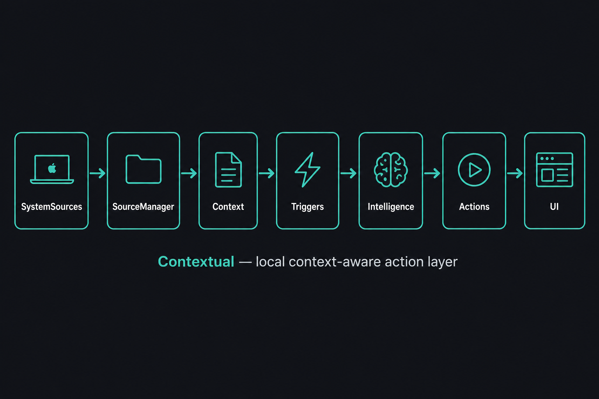
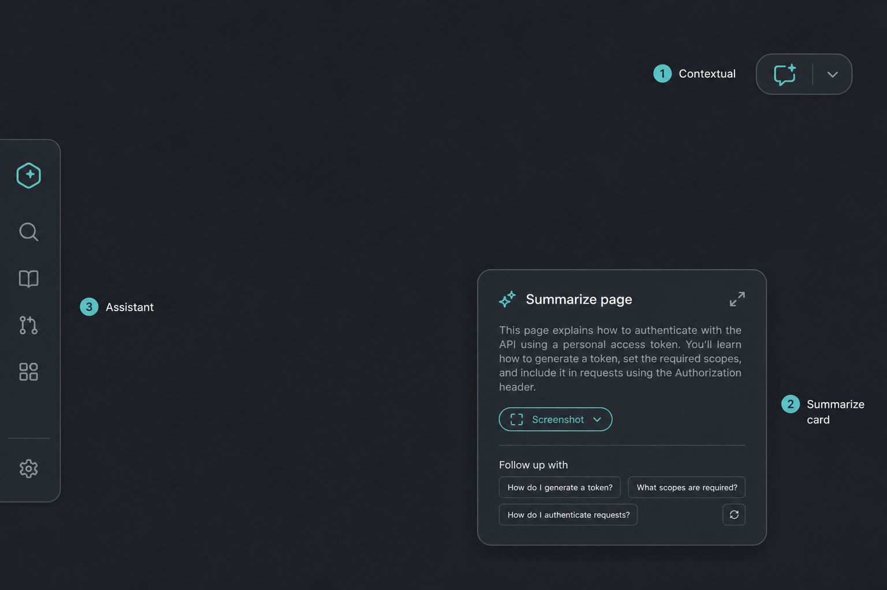
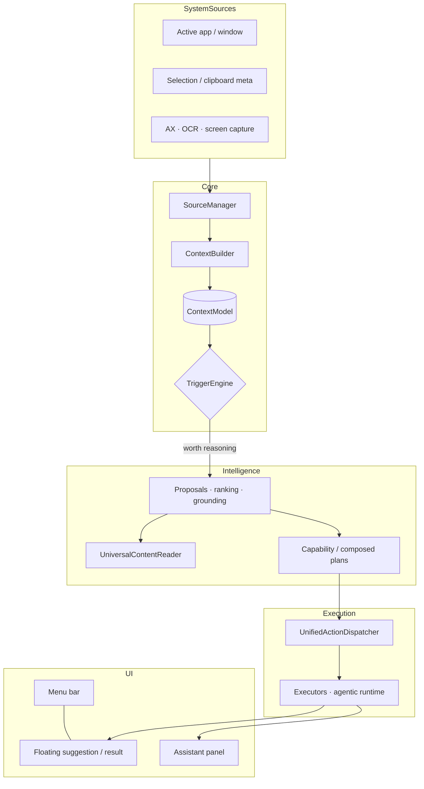
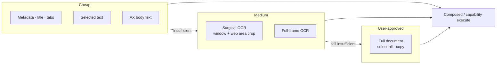
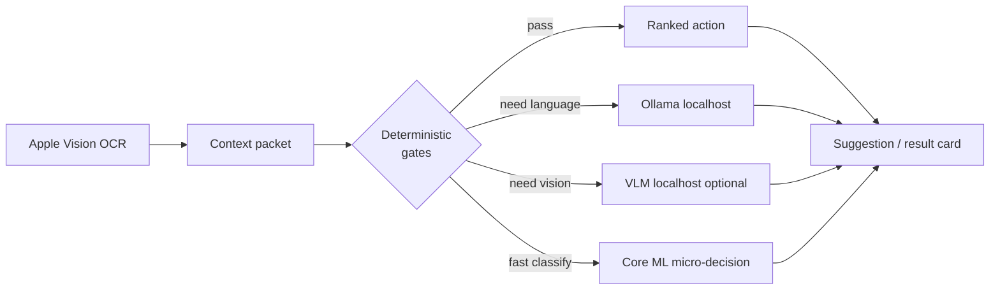
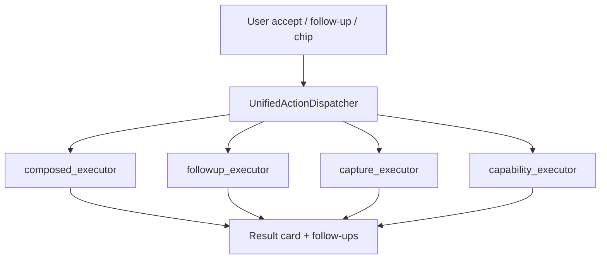

# Contextual

**macOS-native, privacy-first, context-aware action layer** — observes permitted local signals, decides when to surface help, and executes useful actions without prompt-first chat.



| | |
|---|---|
| **Platform** | macOS 13+ · Swift 5 · SwiftUI / AppKit |
| **Model** | Ambient suggestions → user accept → isolated executors |
| **AI default** | Deterministic policy first; local Ollama / Vision OCR / optional VLM on escalation |
| **Privacy** | Local-first · no raw clipboard/screenshot history · permission-gated capture |

---

## At a glance

Contextual is **not** a chatbot shell. It is a background **workflow interpreter** that:

1. Collects **structured context** (app, window, selection, AX, OCR, metadata).
2. **Stays silent** when confidence is low (cooldowns, grounding, usefulness gates).
3. Surfaces **one actionable suggestion** or a **result card** with follow-ups.
4. Acquires content **by intent** (visible text → OCR → full document), not blind AX defaults.



---

## Pipeline

Strict layer separation ([`AGENTS.md`](AGENTS.md)) — no business logic in UI, no macOS APIs outside `SystemSources`, no direct model calls from views.



| Layer | Does | Must not |
|-------|------|----------|
| `SystemSources` | macOS / app events | UI, AI, decisions |
| `Context` | Structured state, fusion | UI, execution |
| `Triggers` | Eligibility, timing, cooldown | Wording, actions |
| `Intelligence` | Rank, acquire, propose, local AI | Render UI |
| `Actions` | Execute accepted work | Collect sources |
| `UI` | Panels, cards, chips | Core logic |

---

## Context acquisition (intent-driven)

Acquisition picks a route from **what the action needs**, not a fixed AX-first default.



**Signals in use:** `ActiveAppSource`, `WindowTitleSource`, `SelectionSource`, `AXWindowContentSource`, `ClipboardSource`, `ScreenCaptureSource`, browser AX frames (`BrowserContextExtractor`), Apple Vision OCR (`OCRProcessor`).

**Product surfaces:** reactive **context chip** on result cards (scope: visible / OCR / full doc / refresh), **expand-in-place** popup, follow-up actions on the parent result.

---

## Intelligence stack



| Component | Role |
|-----------|------|
| **Policies** | Usefulness, live-path enforcement, cooldowns, grounding |
| **Ollama** | `127.0.0.1:11434` — structured generate, two-stage router/planner |
| **Vision OCR** | On-demand capture paths; tab-strip sanitization |
| **Core ML** | Optional micro-decision classifier (safe fallback if missing) |
| **VLM** | Opt-in `CONTEXTUAL_VLM_ENABLED=1` · `127.0.0.1:8123` |
| **Agentic** | Bounded observe→decide→act with evidence + world-state delta |

**Not in default runtime:** cloud inference, vector RAG, LLM fine-tuning.

---

## Execution routes



Ontology snapshot: **56 executable capabilities**, policy traits via `CognitiveCapabilityRegistry` + `WorkflowActionOntology` (see [`docs/action_ontology_audit.md`](docs/action_ontology_audit.md)).

---

## Repository layout

```text
App/              Menu bar, floating windows, AppState
SystemSources/    AX, clipboard, selection, screen capture
Context/          ContextModel, fusion, sessions
Triggers/         TriggerEngine, cooldowns, timing
Intelligence/     Proposals, UCR, composed plans, agentic, self-tests
Actions/          UnifiedActionDispatcher, action modules
UI/               SwiftUI panels, result cards, context chip
docs/             Architecture, phase audits, assets/
```

---

## Build & verify

```bash
xcodebuild -project Contextual.xcodeproj -scheme Contextual \
  -configuration Debug -derivedDataPath build/DerivedData build
```

Expect: `** BUILD SUCCEEDED **`

| Harness | Env flag |
|---------|----------|
| Phase 53 composed actions | `CONTEXTUAL_RUN_PHASE53_SELFTEST=1` |
| Phase 65 result / chip matrix | `CONTEXTUAL_RUN_PHASE65_SELFTEST=1` |
| Product dogfood matrix | `CONTEXTUAL_RUN_PRODUCT_DOGFOOD_MATRIX=1` |
| Live path proof | `CONTEXTUAL_RUN_LIVE_PATH_PROOF=1` |
| Debug LLM output | `CONTEXTUAL_DEBUG_LLM_OUTPUT=1` |
| Optional VLM | `CONTEXTUAL_VLM_ENABLED=1` |

Logs (dogfood): `~/Library/Logs/Contextual/dogfood-live.log` · Menu bar → **Reveal Diagnostics Log**

---

## Permissions

| Capability | macOS permission |
|------------|------------------|
| AX text / browser frames | Accessibility |
| OCR / surgical capture | Screen Recording |
| Select-all document capture | Accessibility + foreground app focus |

---

## Deeper docs

| Doc | Contents |
|-----|----------|
| [`docs/spec-summary.md`](docs/spec-summary.md) | Product spec (short) |
| [`docs/archeitecture.md`](docs/archeitecture.md) | Layer architecture |
| [`docs/build-plan.md`](docs/build-plan.md) | Phase build order |
| [`docs/next_phase_repair_plan.md`](docs/next_phase_repair_plan.md) | Context acquisition repair plan |
| [`docs/roadmap-phase-9-plus.md`](docs/roadmap-phase-9-plus.md) | Extended roadmap |
| [`AGENTS.md`](AGENTS.md) | Contributor layer rules |

---

## Philosophy

**Silence over noise.** A bad suggestion is worse than none. Scale by **modules and policy**, not by mixing UI with acquisition or hardcoding site-specific routes. Local context → structured decision → isolated execution → native surfaces.
